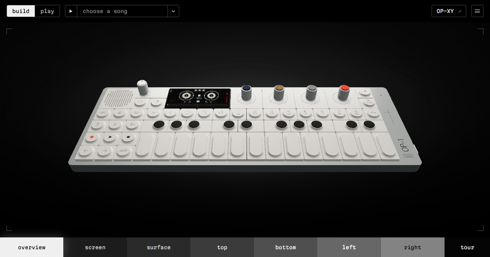
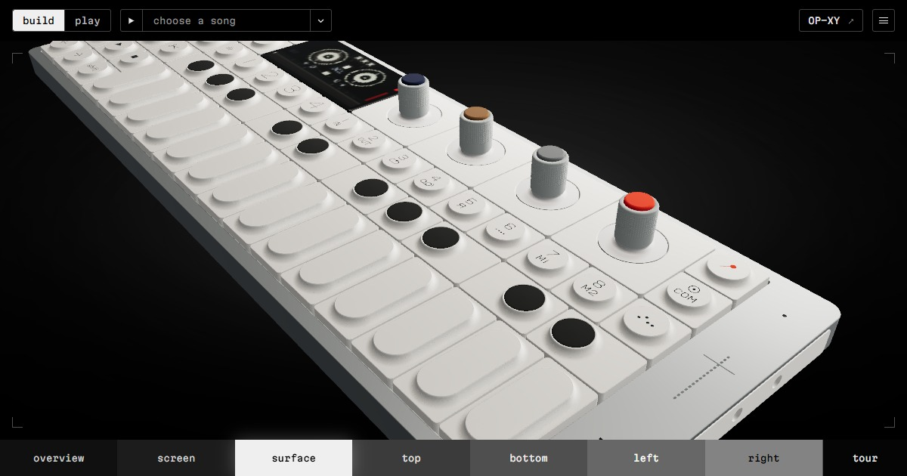

# OP-1 Field | Interactive Study

An interactive browser interpretation of the Teenage Engineering OP-1 Field. Play the instrument, shape sounds, record to four-track tape and explore its physical details.

**[Open OP-1 Field](https://mitchivin.github.io/te-op1-field/)** · **[Explore OP-XY](https://mitchivin.github.io/te-opxy/)**

Works on desktop and phone. Choose **Build** to watch an arrangement take shape through the instrument and tape controls, **Play** to hear the result, or use the device to make your own sounds.

- Playable keys, buttons and encoders with a responsive device display.
- Synth and drum engines, editable samplers and effects.
- Four-track tape recording, editing, playback and mixing.
- Featured arrangements of 19-2000, Still D.R.E., Clint Eastwood, Numb / Encore and Super Mario Bros.
- Camera views for the screen, controls and hardware details.

The arrangements use the study's instruments and tape workflow. This is a browser interpretation with simulated sound and workflows, not official firmware or a complete hardware emulator.

This repository contains the compiled website and public project information. The original application source is maintained privately alongside the OP-XY study.

## Related

- [OP-XY study](https://github.com/mitchivin/te-opxy)
- [MiPod Classic](https://github.com/mitchivin/mipod)
- [Mi Boy Color](https://github.com/mitchivin/miboy)
- [Mitch Ivin](https://mitchivin.com/)

Built by [Mitch Ivin](https://mitchivin.com/). An independent creative project inspired by the Teenage Engineering OP-1 Field, with no affiliation to Teenage Engineering.
